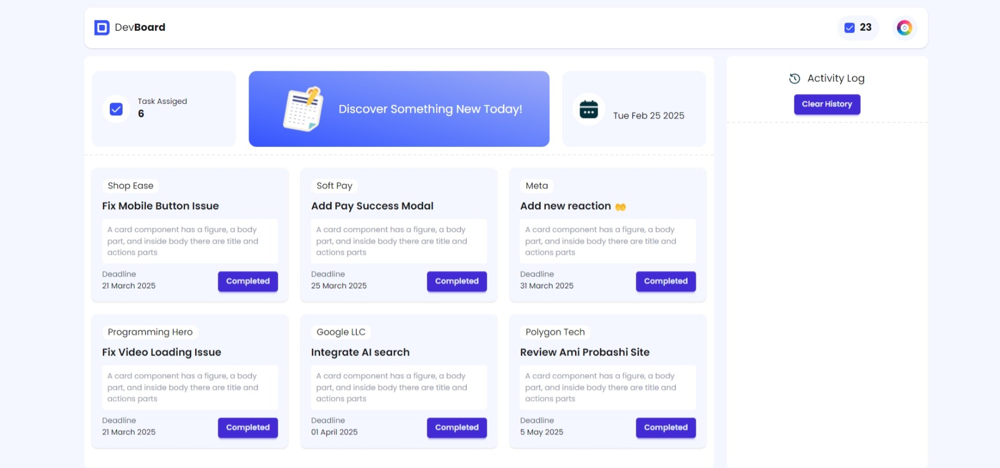

# DevBoard - Interactive Task Management Dashboard

A modern, responsive task management board built with **HTML5**, **Tailwind CSS**, and **Vanilla JavaScript DOM Manipulation**.



---

## 📅 Assignment Details & Deadlines
- **Deadline For 60 marks**: 2nd March, 2025 (11:59 pm ⏱️)
- **Deadline For 50 marks**: 3rd March, 2025 (11:59 pm ⏱️)
- **Deadline For 30 marks**: Any time after 3rd March, 2025.

---

## 🏆 Key Features & Requirements

1. **Dynamic Task Management**:
   - **Task Assigned Counter**: Displays assigned tasks count (`06`), decreasing by 1 whenever a task is marked complete.
   - **Total Completed Counter**: Starts at `23` in the navbar and increments by 1 with each finished task.
   - **Single-Click Completion**: Clicking the "Completed" button updates counters, appends an activity log with the current timestamp, and permanently disables the button.
   - **Completion Alerts**:
     - Displays `Board Updated Successfully` on task completion.
     - Displays `Congrats!!! You have completed all the current task` when all 6 tasks are finished.

2. **Activity Log & Clear History**:
   - Logs every completed task in real time with dynamic timestamp (`hh:mm:ss AM/PM`).
   - "Clear History" button instantly purges the activity log container.

3. **Dynamic Date Display**:
   - Automatically computes and renders the live day of the week and date (e.g., `Wed ,` and `Sep 16 2026`).

4. **Dynamic Theme Controller**:
   - Clicking the palette theme icon smoothly changes the page's background color to a random pastel tone.

5. **Multi-Page Navigation**:
   - Clicking the "Discover Something New Today!" banner navigates to `blog.html`.
   - Clicking "Back to Desk" in `blog.html` returns back to `index.html`.

6. **Fully Responsive Design**:
   - Tailored for mobile, tablet, laptop, and ultra-wide screens using Tailwind CSS responsive grid & flex utilities.

---

## 📂 Project Structure

```
Dev-Board/
├── assets/
│   ├── activity.png
│   ├── board.png
│   ├── calendar.png
│   ├── calender.png
│   ├── checkbox.png
│   ├── logo.png
│   ├── teme-btn.png
│   └── theme-btn.png
├── js/
│   ├── script.js       # Core completion logic, alerts, counters, and timestamp
│   ├── tasks.js        # Event listeners for task buttons and clear history
│   ├── theme.js        # Dynamic random background theme generator
│   └── time.js         # Real-time date and day formatter
├── blog.html           # Questions and answers regarding DOM manipulation
├── index.html          # Main DevBoard application
├── preview.jpeg        # Design reference preview
├── preview.jpg         # Asset preview alias
├── README.md           # Project documentation
└── tailwind.config.js  # Tailwind configuration
```

---

## 📝 Required Questions & Answers (from `blog.html`)

### **Question-1: What are the different ways to select an element in the DOM?**
- `document.getElementById('id')`: Selects a single element by its ID.
- `document.getElementsByClassName('class')`: Selects all elements matching a class (returns an `HTMLCollection`).
- `document.getElementsByTagName('tag')`: Selects elements by HTML tag name (returns an `HTMLCollection`).
- `document.querySelector('selector')`: Selects the first element matching a CSS selector.
- `document.querySelectorAll('selector')`: Selects all elements matching a CSS selector (returns a `NodeList`).

### **Question-2: What is the difference between innerHTML, innerText, and textContent?**
- **`innerHTML`**: Returns or sets raw HTML string, interpreting and rendering HTML tags.
- **`innerText`**: Returns or sets rendered, visible human text, respecting CSS styles (ignores `display: none`) and triggering reflow.
- **`textContent`**: Returns or sets raw text of all nodes including hidden content, without parsing HTML or triggering reflow.

### **Question-3: What is event delegation in the DOM?**
Event delegation is a design pattern where an event listener is placed on a parent element instead of attaching listeners to multiple individual child elements. It takes advantage of event bubbling: events on child elements bubble up to the parent where `event.target` identifies the specific trigger source.

### **Question-4: What is event bubbling in the DOM?**
Event bubbling is the default propagation phase in the DOM where an event triggered on a child node travels upwards through its ancestor tree (child &rarr; parent &rarr; body &rarr; html &rarr; document &rarr; window) unless stopped via `event.stopPropagation()`.

### **Question-5: How do you create, add, and remove elements using JavaScript?**
- **Create**: `document.createElement('tagName')` creates a new DOM node in memory.
- **Add**: `parentElement.appendChild(node)` or `parentElement.append(node)` inserts the node into the DOM tree.
- **Remove**: `node.remove()` or `parentElement.removeChild(node)` deletes the node from the DOM.
